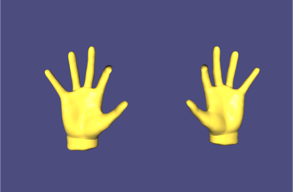

# Skeletal Animation for Three-finger Exoskeleton 
This application allows real-time rendering of the 
[three-finger exoskeleton](https://github.com/amartsop/Exoskeleton)
with the help of a photorealistic hand model.
The proposed model is based on the principles of 
skeletal animation.
 Using this techique the virtual hand is represented in two parts:
the mesh which constitutes a realistic representation of the geometry and a hierarchical set of
interconnected parts (called bones) that define the motion of the virtual avatar. Each bone has a
three-dimensional transformation from the default bind pose (which includes its position, scale and
orientation), and an optional parent bone. The bones therefore form a hierarchy. The full transform
of a child node is the product of its parent transform and its own transform.
Each bone in the skeleton is associated with some portion of the character’s visual representation
(the mesh) in a process called skinning. In the most common case of a polygonal mesh character,
the bone is associated with a group of vertices; for example, in a model of a human being, the bone
for the thigh would be associated with the vertices making up the polygons in the model’s thigh.



Portions of the character’s skin can normally be associated with multiple bones, each one having a
scaling factors called vertex weights, or blend weights. The movement of skin near the joints of two
bones, can therefore be influenced by both bones. By applying these ideas the user can apply direct
transformations to the bones of the model and produce real-like deformations of the surrounding
mesh.

For more information on the software please see the reference document 
[reference document](https://github.com/amartsop/ExoskeletonHandover/blob/master/main.pdf), while for the full documentation please visit the [API referece](https://amartsop.github.io/SkeletalAnimationMultiThread/index.html).

## Installation
1. Git clone the repository.

2. Install the appropriate dependencies. This can be done manually or with the help of the inculded installation bash script [.installlation.sh](./.installation.sh). If the user wants to install dependencies
manually, the full list of them is included in the provided .installlation.sh file. To execute the installation file:
    1.  Login as root and navigate to the directory where the installation file is located.
    2. Run 
    ```
    $ source ./.installation.sh 
    ```
    > **Warning**: This will install quite a few libraries and packages in your computer. Please make sure that you are aware of the packages that are installed and with the location in which they are installed. Both settings can be changed by editing the ”.installations.sh” file.


